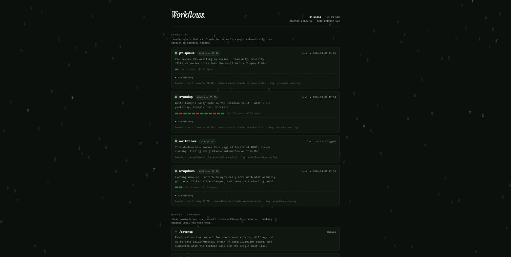
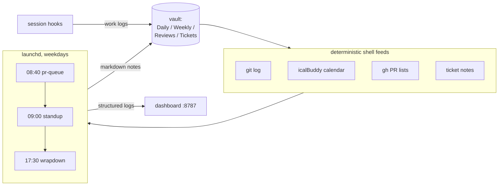

<div align="center">


# Claude Workflows

**A local AI chief-of-staff for your dev day — scheduled Claude Code agents that write your standup, pre-review your PRs, and wrap up your evening, all tracked on a matrix-rain dashboard.**




</div>

---

## What you get

Three scheduled agents, one always-on dashboard, and session hooks that make each other smarter — a pipeline where every piece feeds the next:

| ⏰ | Job | What it does |
|---|---|---|
| 08:40 | **pr-queue** | Pre-reviews every PR awaiting your review. Reads the diff, cross-checks callers in your local repos, writes a severity-filtered note per PR (Critical/High/Medium only — zero nitpicks). Read-only against GitHub: it *cannot* post comments. |
| 09:00 | **standup** | Writes today's daily note: what you did yesterday (from commits, ticket logs, calendar), today's plan, blockers — plus a copy-paste-ready standup block for your team, wikilinked to the fresh pre-review notes. |
| 17:30 | **wrapdown** | Appends an evening Wrap-up: what actually got done, what *didn't* happen vs. the morning plan, and tomorrow's starting point. Updates ticket statuses as PRs move. |
| always | **workflows** | A live dashboard at `localhost:8787` — every automation, schedule, run history, per-run cost, failures — wrapped in a matrix-rain background that decodes your favorite quotes. Ships as a Dock/Spotlight app. |

Plus **session hooks**: every Claude Code session on a ticket branch starts knowing the ticket's history (SessionStart injects the ticket note) and ends by appending a work-log entry (SessionEnd) — which is exactly what tomorrow's standup reads. The loop closes itself.



## Requirements

| Dependency | Why | Install |
|---|---|---|
| macOS | `launchd` scheduling, notifications | — |
| [Claude Code](https://claude.com/claude-code) | the agent (`claude -p` headless) | `npm i -g @anthropic-ai/claude-code`, then log in once |
| [gh](https://cli.github.com) | PR/issue feeds | `brew install gh && gh auth login` |
| `jq` | JSON parsing in the runner & hooks | `brew install jq` |
| Python ≥ 3.10 | the dashboard (stdlib only, zero pip installs) | `brew install python3` |
| [icalBuddy](https://hasseg.org/icalBuddy/) *(optional)* | meeting feeds | `brew install ical-buddy` |
| Google Chrome *(optional)* | the chromeless app window | falls back to your default browser |

Cost: each job is one headless Claude session with a `--max-turns` cap. Typical day: standup ~$0.80, wrapdown ~$0.60, pr-queue ~$1–4 depending on how many PRs are new (unchanged PRs are skipped). On a Claude subscription these draw from your usage window instead of billing per token.

## Install

```bash
git clone https://github.com/YOUR_USER/CCyclops.git
cd CCyclops
./install.sh          # interactive — asks for your vault, org, calendars
./install.sh --dry-run  # see what it would do first
```

The installer copies everything into `~/.claude/`, registers the session hooks in `settings.json` (merging, never clobbering), builds the app bundle, and loads the launchd agents. Re-running it is safe: machinery is updated, your quotes/favicon/notes/logs are never touched.

> **The lazy path:** clone the repo and tell Claude Code *"read this repo and set it up for me"*. The prompts, scripts, and this README are all the context it needs — it can also adapt any part to your workflow while it's at it (different times, another ticket system, no calendar…).

Then:

```bash
workflows                                # opens the dashboard app window
bash ~/.claude/scripts/standup-cron.sh   # test-drive a job right now
```

## Obsidian — or any folder of Markdown

Everything the agents write is **plain Markdown in plain folders**:

```
<your vault>/Workflows/
├── Daily/      2026-09-01.md …      ← standup + wrapdown
├── Weekly/     2026-W36.md …        ← /veckan rollup (manual)
├── Reviews/    repo-PR123.md …      ← pr-queue
└── Tickets/    1234 Fix login.md …  ← session hooks
```

**With Obsidian**: point a vault at (or above) this folder and you get wikilinks between dailies ↔ tickets ↔ reviews, graph view, and a one-click copy button on the standup block for free.

**Without Obsidian**: it all still works — any editor, `grep`, GitHub, Logseq, or nothing at all. Only two conveniences are Obsidian-flavored: `[[wikilinks]]` and the copy button on code fences. To go fully tool-neutral, edit `commands/standup.md` and `commands/wrapdown.md` and change the wikilink rules to plain text. Different destination entirely (a git repo of notes, iCloud, a synced folder)? Just point the vault path at it during install.

## Make it yours

| What | How |
|---|---|
| **Quotes in the rain** | `~/.claude/scripts/workflows-quotes.json` — an array of strings, picked up on next refresh |
| **Dashboard palette** | CSS variables at the top of `workflows-dashboard.py` (`--bg`, `--ok`, `--err`, …) |
| **Rain speed / glyphs / fps** | constants at the top of the `JS` block in the same file (`GLYPHS`, `speeds`, the fps cap) |
| **Page favicon** | replace `~/.claude/scripts/workflows-favicon.png` |
| **App icon** | run `scripts/mask_icon.py` on any square PNG to get macOS-style rounded icons, or `scripts/make_icon.py` for the generated default; compile with `iconutil` |
| **Schedules** | edit the plists in `~/Library/LaunchAgents`, then `launchctl bootout` + `bootstrap` |
| **Standup voice & format** | it's all prompt — edit `commands/standup.md` (the note template and team-standup rules are right there) |
| **A whole new job** | copy any `<job>-cron.sh` + plist + `commands/<job>.md` triple and rename — it appears on the dashboard automatically, described by its own frontmatter |

## Design principles

These are the load-bearing decisions — keep them when you fork:

1. **Deterministic work in shell, Claude only synthesizes.** Git, calendar, and PR data are gathered by scripts and injected as context. Cheap, reproducible, debuggable.
2. **Scoped permissions.** Every job runs with `--permission-mode acceptEdits` plus a tight `--allowedTools` allowlist. The PR reviewer's allowlist simply contains no GitHub write commands.
3. **Fail loud, never thinner.** If a data feed errors, the job refuses to write and notifies you (`FEED FAILURE`), instead of producing a note that looks fine but is silently missing data.
4. **Control flow lives in bash, not the model.** Watchdog (15 min), one retry, JSON parsing, cost logging, usage-limit detection, and macOS notifications are all in `scripts/job-lib.sh` — the LLM is treated like an API dependency.

## Troubleshooting

<details>
<summary><b>A job failed — where do I look?</b></summary>

The dashboard shows a red banner for failures in the last 7 days (dismissable with ×), and you get a macOS notification. Details: `tail -50 ~/.claude/logs/<job>-cron.log`. Exit codes: `1` claude error · `2` feed failure · `3` preflight failed (usually `gh auth login` needed) · `124` watchdog kill.
</details>

<details>
<summary><b>The meetings section is empty</b></summary>

icalBuddy needs the Calendar permission: run `icalBuddy eventsToday` once in Terminal and approve the macOS prompt. Headless Claude can't hold that grant, which is why the cron wrapper pre-fetches to a cache before launching Claude.
</details>

<details>
<summary><b>Runs fail around heavy-usage times</b></summary>

On a Claude subscription, the rolling usage window can starve scheduled jobs. The runner detects it, notifies you, and skips the pointless retry. Schedule heavy jobs away from your peak interactive hours if it recurs.
</details>

<details>
<summary><b>Jobs don't run when the Mac is asleep</b></summary>

`launchd` fires a missed `StartCalendarInterval` once on wake (not if powered off). If your Mac sleeps through 09:00, the standup runs when you open the lid.
</details>

## License

MIT — fork it, gut it, make it write your standup.
